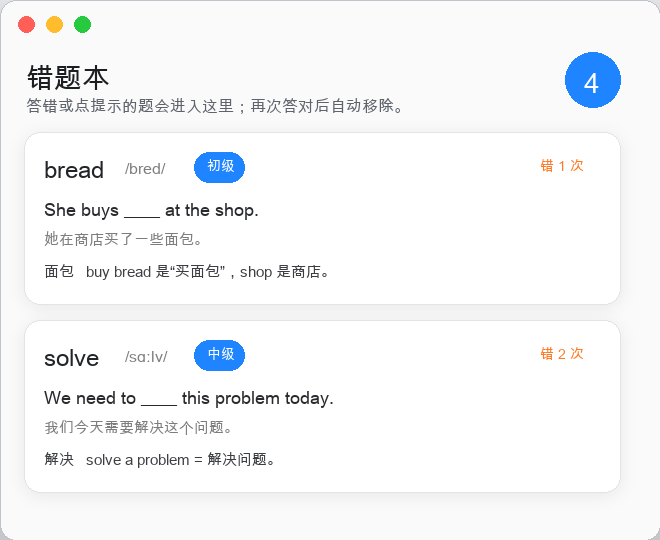

# Gapfill — Mind the Gap

> A tiny menu-bar English practice app. Fill the missing word, check the sentence meaning, and let short idle moments turn into vocabulary review.

空闲一段时间后，屏幕右上角弹出一道填空练习：一句英文挖掉一个词，配上整句中文翻译，让你填对应的英文单词。练习记录会持久化，**经常做错的题会更频繁地推给你**。

## 截图

<table>
  <tr>
    <td align="center"><b>菜单栏入口</b></td>
    <td align="center"><b>答题卡片</b></td>
    <td align="center"><b>错题本</b></td>
  </tr>
  <tr>
    <td></td>
    <td></td>
    <td></td>
  </tr>
</table>

## 功能

- 🕐 **空闲检测**：无键盘/鼠标操作超过 10 分钟后自动弹题（可调）
- 📖 **整句翻译 + 单词讲解**：答对或点提示后显示释义、音标、词性和记忆提示
- 🎚️ **三档难度**：可在菜单中选择初级、中级、进阶
- 📝 **错题本**：答错或点提示的题会记录，之后答对会自动移除
- 🧠 **加权选题**：常错的题权重更高，掌握后逐渐淡出（Leitner 算法）
- ⌨️ **即时聚焦**：弹出后输入框自动获焦，直接打字即可
- 🤖 **AI 出题**：后台调用 Codex CLI 实时生成初级新题，内置 16 道题保底
- 📊 **今日统计**：菜单栏实时显示题数与正确率
- 💾 **进度持久化**：重启后仍记得"这道我以前错过"

## 系统要求

| 项目 | 要求 |
|------|------|
| macOS | 13.0 Ventura 及以上 |
| 架构 | Apple Silicon（arm64） |
| Codex CLI | 可选，用于 AI 生成新题 |

## 安装与运行

### 方案 A：Swift Package Manager（无需 Xcode）

```bash
git clone https://github.com/feng-Qinyu/Gapfill.git
cd Gapfill
swift build -c release
```

构建完成后创建 app bundle：

```bash
APP="$HOME/Applications/Gapfill.app"
mkdir -p "$APP/Contents/MacOS" "$APP/Contents/Resources"
cp .build/release/Gapfill "$APP/Contents/MacOS/"
cp Resources/Info.plist "$APP/Contents/"
cp Resources/AppIcon.icns "$APP/Contents/Resources/"
codesign --force --deep --sign - "$APP"
```

### 方案 B：XcodeGen（需要 Xcode）

```bash
brew install xcodegen
./build.sh        # 生成工程并打开 Xcode
# 在 Xcode 里按 Cmd-R 运行
```

### 设置为开机启动（推荐）

```bash
# 创建 LaunchAgent（开机自动启动）
cat > ~/Library/LaunchAgents/com.example.Gapfill.plist << 'EOF'
<?xml version="1.0" encoding="UTF-8"?>
<!DOCTYPE plist PUBLIC "-//Apple//DTD PLIST 1.0//EN" "http://www.apple.com/DTDs/PropertyList-1.0.dtd">
<plist version="1.0">
<dict>
    <key>Label</key>
    <string>com.example.Gapfill</string>
    <key>ProgramArguments</key>
    <array>
        <string>/Applications/Gapfill.app/Contents/MacOS/Gapfill</string>
    </array>
    <key>RunAtLoad</key>
    <true/>
    <key>KeepAlive</key>
    <false/>
</dict>
</plist>
EOF

launchctl load ~/Library/LaunchAgents/com.example.Gapfill.plist
```

> **macOS 安全提示**：如果 Finder 双击无反应，通过终端启动一次：  
> `open /Applications/Gapfill.app`  
> 或使用上方的 LaunchAgent 方案（推荐，完全绕开 Gatekeeper）。

## 使用说明

启动后菜单栏出现 📖 图标，点击展开菜单：

| 操作 | 说明 |
|------|------|
| **来一题** `⌘⇧E` | 立刻弹出一道题，不等空闲 |
| **暂停/开启自动弹出** | 临时关闭空闲检测 |
| **难度** | 在初级、中级、进阶之间切换 |
| **错题本** | 查看历史错题、错题次数和单词讲解 |
| **退出** `⌘Q` | 完全退出 |

卡片操作：

| 操作 | 说明 |
|------|------|
| 直接打字 | 弹出后输入框自动聚焦 |
| `Return` / 检查 | 提交答案 |
| 提示 | 显示正确答案、释义、音标、词性和记忆提示（计入错误） |
| 再来一个 | 答完后立刻出下一题 |
| 稍后再说 | 关闭卡片，1 小时内不再自动弹 |

## 可调参数

| 文件 | 变量 | 默认值 | 说明 |
|------|------|--------|------|
| `Coordinator.swift` | `idleThreshold` | `600` | 多少秒空闲后弹题（调成 `15` 方便调试） |
| `Coordinator.swift` | `cooldown` | `45` | 答完一题后的冷却时间（秒） |
| 菜单栏 | `难度` | `初级` | 出题难度，可直接选择三档 |

## 项目结构

```
Sources/
├── EnglishClozeApp.swift   # 入口；菜单栏图标与下拉菜单
├── Coordinator.swift       # 空闲检测 → 决定何时弹卡
├── IdleMonitor.swift       # 用 CGEventSource 读系统空闲时长
├── PopupController.swift   # 右上角浮层面板（KeyablePanel 支持键盘输入）
├── ClozePopupView.swift    # 填空练习卡片 UI
├── ClozeModel.swift        # 卡片模型、内置题库、持久化、加权选题
└── CodexGenerator.swift    # 调 Codex CLI 后台生成新题
```

**数据存储**：`~/Library/Application Support/Gapfill/state.json`

## AI 出题（可选）

需要本机可用的 Codex CLI。Gapfill 会按下面顺序查找：

1. `CODEX_CLI_PATH` 环境变量
2. PATH 里的 `codex`
3. Codex 桌面应用内置的 CLI

```bash
/Applications/Codex.app/Contents/Resources/codex
```

如果你想在终端里直接使用 `codex`，可以安装 CLI：

```bash
npm install -g @openai/codex
codex auth          # 登录 OpenAI
which codex         # 确认终端可找到 codex
```

未安装 Codex 时，app 使用内置 16 道题正常运行，不影响基础功能。

## License

MIT
